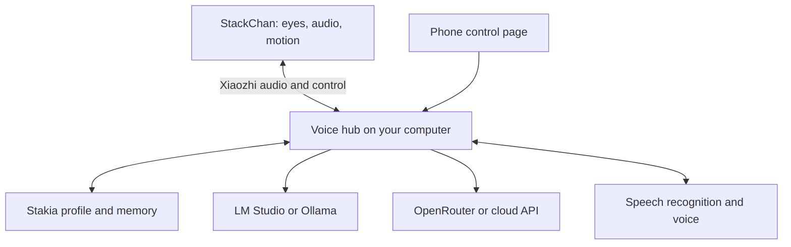

# September 17 security correction

The implementation now uses authenticated TLS, a locally generated CA, a private robot credential, and a localhost-only dashboard. Earlier plaintext/unauthenticated proposals below are historical and superseded. See README.md and firmware/STAKIA-BUILD.md for current setup.

# Stakia: StackChan Upgrade Research & Build Plan

**Prepared for Mars · Research date: 2026-09-15 · Revised: 2026-09-16 · Version 1.2**

**Recommendation:** Give Stakia a custom face on her existing display and connect her to a self-hosted voice/AI hub on your computer. Start with LM Studio, add an OpenRouter profile, and keep her personality, memory, and voice independent of the selected model.

**Starting point:** Mars supplied his earlier [stackchan-local-agent project](https://github.com/rustyorb/stackchan-local-agent) after the initial research. Reuse its useful host-side pieces, repair the integration gaps below, and choose firmware against the actual hardware. The earlier attempt achieved marginal success before Mars returned to stock; the repository alone does not establish exactly why.

**Readiness:** Ready for design review and an initial bench session, with stated hardware assumptions. Firmware selection and flashing remain conditional on identifying your actual unit. This document records research and proposed work; nothing has been flashed, deployed to your computer, or tested on your robot.

## Implementation update: user-controlled local operation

The September 16 implementation supersedes the original vendor-bootstrap approach below. Mars explicitly wants independence from vendor cloud/accounts. The current firmware patch connects directly to a compiled private LAN WebSocket, ignores old vendor endpoint settings, disables vendor activation/OTA, and retains local hardware controls. Host defaults must specify local speech and model providers explicitly. OpenRouter remains opt-in. Mars has a maintained stock restore option; no backup or stock rebuild is required. His PC already has ESP-IDF installed, version unconfirmed. A reported 32 GB removable card is available; its format and contents have not been inspected.

## 1. What we are making

A recognizable little companion with large expressive color eyes, natural conversational timing, a voice you actually like, and a brain you can change without rebuilding her identity.

Your explicit requests:

- Better, more expressive eyes.
- Local LLM operation or selectable services such as OpenRouter and other cloud models.
- Useful additional improvements.
- User-adjustable pause detection: the current robot ends Mars's turn after approximately a two-second pause, which is too soon.
- User-adjustable conversation idle timeout: the current robot announces an exit after approximately four quiet minutes; Mars wants control over this behavior.
- A researched plan prepared while you are away from your computer.

Context carried forward: you already use LM Studio/Open WebUI, have been developing Stakia's personality, and recently found her voice too low after a pitch adjustment. Preserve that personality work. The exact prompt and current voice-provider settings are not available here, so neither is reconstructed or silently replaced.

The separate Matrix Portal M4 idea is not used as evidence of StackChan's hardware. An older context fragment also mentions a StackChan/Pi Zero 2 W idea, but does not identify your current physical robot.

### Working hardware assumption

The main plan targets the commercial M5Stack StackChan, SKU K151/K151-R, using its original StackChan Core controller. If yours is a DIY Core2/CoreS3 build, reuse the hub and behavior design but choose the firmware branch only after identifying its board and servo wiring.

M5Stack's documentation explicitly distinguishes original StackChan controllers from ordinary CoreS3 variants for mobile-app compatibility. A generic CoreS3 is not automatically an interchangeable replacement. [Official StackChan documentation](https://docs.m5stack.com/en/StackChan)

## 2. The findings that matter

| Finding | Practical consequence |
|---|---|
| The commercial unit has a 320×240 color IPS display. | Start with software eyes. A screen purchase is unnecessary for the first upgrade. |
| Its ESP32-S3 has 8 MB PSRAM and 16 MB flash. | Keep rendering, audio transport, and motion on-device; host a useful conversational LLM elsewhere. |
| It already includes microphones, a speaker/amplifier, camera, touch inputs, LEDs, and feedback servos. | The first build can reuse the existing hardware. |
| M5Stack changed the LCD driver on 2026-08-07. | Verify display initialization before trusting an older firmware build. |
| Factory-source eyes are modular LVGL objects. | A custom eye implementation can preserve the surrounding firmware. |
| The AI voice connection uses Xiaozhi protocols. | LM Studio's HTTP endpoint cannot directly replace the robot's WebSocket/OTA server. A compatible voice hub goes between them. |
| The self-hosted server has LM Studio/Ollama configuration and a generic OpenAI-compatible LLM adapter. | Model choice is achievable through backend configuration and a small control layer. |
| The saved OTA URL takes precedence over the compiled default. | Changing a build setting alone may leave the robot contacting the previous AI service. |
| Factory-source mouth animation is timed/random while speaking. | Audio-driven mouth movement is a concrete improvement. |
| Self-hosting the AI backend does not automatically self-host the mobile-app ecosystem. | Treat voice independence and app/community services as separate work. |

Hardware findings: [StackChan specifications and change history](https://docs.m5stack.com/en/StackChan), [CoreS3 audio hardware](https://docs.m5stack.com/en/core/CoreS3). Software findings are substantiated by the individual source links below.

### Source versions inspected

These are the actual retrieved source snapshots, not claims about the firmware installed on your robot:

| Project | Snapshot | Relevance |
|---|---|---|
| Mars's stackchan-local-agent | `7f63cfd377d81f1840db2a0f0d26335037401a90`, commit dated 2026-04-27 | Earlier bridge, dashboard, providers, configuration, firmware scaffold. Read-only review on September 16. |
| M5Stack StackChan | `1b5765599fba8aaad1811d9a79358ccc7051f5f3`, commit dated 2026-08-19 | Source declares firmware 1.5.1; factory firmware, app, server. |
| Xiaozhi firmware | Tag `v2.2.4`, `e77dedb1309153bb63fed285772962c920c97dd4` | Dependency selected by the inspected StackChan source. |
| xinnan-tech Xiaozhi server | `6afc54a17def47578a4b3efc4680873689d3168b`, commit dated 2026-09-11 | Self-hosted voice/backend adapters. |

The StackChan repository cautions that published source can trail distributed firmware/app versions. Its current build instructions specify ESP-IDF **5.5.4**. Its dependency manifest selects Xiaozhi **v2.2.4**, with a local patch, and LVGL **~9.4.0**. Use that matched baseline first; do not arbitrarily substitute the latest version of every dependency. [Repository](https://github.com/m5stack/StackChan), [build instructions](https://github.com/m5stack/StackChan/blob/1b5765599fba8aaad1811d9a79358ccc7051f5f3/firmware/README.md), [dependency selection](https://github.com/m5stack/StackChan/blob/1b5765599fba8aaad1811d9a79358ccc7051f5f3/firmware/repos.json), [component manifest](https://github.com/m5stack/StackChan/blob/1b5765599fba8aaad1811d9a79358ccc7051f5f3/firmware/main/idf_component.yml).

## 3. Choose this architecture

### Approach comparison

| Approach | Strength | Cost or limitation | Decision |
|---|---|---|---|
| **Factory-source fork + existing Xiaozhi server + selectable models** | Reuses robot drivers, audio transport, expressions, and existing provider adapters. | Requires endpoint migration, English/personality configuration, and some custom controls. | **Recommended first implementation.** |
| Custom firmware using StackChan BSP + a new voice hub | Maximum control over every state and dependency. | More audio, reconnect, graphics, and hardware integration work. | Reserve for concrete limits discovered in the recommended route. |
| Add a separate local compute module/SBC | Can operate independently of your main computer. | Extra power, mounting, heat, model constraints, and integration. | Later option if standalone operation becomes important. |

The official Arduino BSP is useful hardware infrastructure, not a ready-made replacement for the complete factory application. Older projects such as AI Stack-chan Ex demonstrate other approaches, including Module LLM and realtime voice, but board support does not establish compatibility with every feature of the commercial robot. [StackChan BSP](https://github.com/m5stack/StackChan-BSP), [AI Stack-chan Ex](https://github.com/ronron-gh/AI_StackChan_Ex)

### System layout

**Robot responsibilities:** render her face, blink and look around, report touch/wake events, capture and play audio, execute bounded gestures, show connection state, and remain responsive when the model is slow.

**Hub responsibilities:** transcribe speech, assemble context, call the selected model, synthesize speech, schedule expression/gesture cues, store memory, and expose settings.

**Phone control page:** a small LAN-accessible interface for changing model, voice, eye appearance, motion intensity, and local/cloud mode. Its first version needs no new native Android app.

Reuse the existing repository as the host-side project. First prove a direct Xiaozhi-to-LM-Studio route as a diagnostic baseline; then restore the bridge once it preserves conversation history and has a clear purpose for persona/settings. Reuse its dashboard selectively after checking which actions have working server endpoints. Keep one authoritative owner for conversation history and persona assembly.

Use the Python-only Xiaozhi server deployment initially. A separate full management stack is unnecessary just to connect one robot. Add only the missing Stakia-specific settings/persistence behavior. [Server deployment documentation](https://github.com/xinnan-tech/xiaozhi-esp32-server/blob/6afc54a17def47578a4b3efc4680873689d3168b/docs/Deployment.md)

## 4. Eyes: the highest-value visible upgrade

### What the source actually does

The factory `DefaultEyes` class draws a circular eye plus a covering eyelid. Its size control maps to an 8–32 pixel range. Separate left/right objects expose position, size, rotation, and openness. The built-in emotion enum contains Neutral, Happy, Angry, Sad, Doubt, and Sleepy.

That is a useful scaffold, but substantially different from large eyes with sclera, colored irises, pupils, highlights, and independently expressive lids. [Eye renderer](https://github.com/m5stack/StackChan/blob/1b5765599fba8aaad1811d9a79358ccc7051f5f3/firmware/main/stackchan/avatar/skins/default/eyes.cpp), [eye interface](https://github.com/m5stack/StackChan/blob/1b5765599fba8aaad1811d9a79358ccc7051f5f3/firmware/main/stackchan/avatar/skins/default/default.h), [emotion enum](https://github.com/m5stack/StackChan/blob/1b5765599fba8aaad1811d9a79358ccc7051f5f3/firmware/main/stackchan/avatar/avatar/elements/emotion.h)

### Proposed face direction

**Large, stylized color eyes on black, with enough asymmetry to have an attitude.**

Initial geometry to prototype, not a tested final layout:

- Two eye regions approximately 96×112 pixels, centered near x=86 and x=234.
- Colored irises around 44–60 pixels, with pupils and one or two restrained highlights.
- Independent upper/lower lids, optional light brows, and a small expressive mouth below.
- Emerald, amber, violet, and ice-blue presets, plus user-selectable colors.
- Keep the iris color stable as part of her identity; convey emotion mostly through shape, gaze, lids, and timing.
- Preserve touch interaction and room for a small status indicator. Put long transcripts on the phone, with optional short captions on the face.

The exact shapes should be reviewed at actual screen size. Detail that looks beautiful on a monitor can become visual clutter on two inches.

### Expression vocabulary

| State | Eyes | Motion/behavior |
|---|---|---|
| Idle | Slow varied blinks, tiny gaze changes | Rare small head adjustment |
| Listening | Gaze settles toward the speaker, lids open slightly | Hold still to reduce self-noise |
| Thinking | Brief upward/sideward gaze, subtle lid tension | One small anticipatory movement |
| Amused | Lower lids rise, slightly asymmetric squint | Small nod; mouth follows speech |
| Curious | One lid/brow rises; pupils track a target | Gentle tilt if the mechanism permits the intended pose |
| Skeptical | Side-eye, one lid lower | Short pause before speaking |
| Surprised | Wider lids, controlled pupil change | Brief recoil within calibrated limits |
| Sleepy | Slow closures and half-lids | Low motion and dimmer display |
| Affectionate | Soft lids and a slow blink | Small lean/turn, not constant hearts |
| Disconnected | A distinct quiet visual cue | Idle animation continues |
| Muted | Stable mute indicator | No audio sent |
| Interrupted | Immediate mouth close, attentive eyes | Cancel queued speaking gestures |

These are proposed behaviors. The current firmware will not acquire them just by receiving new emotion names.

### Implementation design

1. Add a custom skin under the existing avatar structure.
2. Preserve the current `Feature` interface for position, size, rotation, visibility, and weight, so existing modifiers remain usable.
3. Define eyelid weight consistently, including blink behavior and recovery to the selected emotion.
4. Extend the emotion mapping only where necessary. Preserve the existing protocol names as aliases.
5. Add higher-level gaze and expression cues through a small, versioned control contract.
6. Run blink, micro-gaze, and interpolation locally. The LLM should request “skeptical,” not calculate every animation frame.
7. Route all LVGL updates through the firmware's existing lock/task discipline.
8. Let connection state override stale model cues; let an explicit expression temporarily override idle expression modifiers.
9. Keep a selectable original skin as a visual fallback.

The current AI display maps only a limited set of incoming emotion strings; unknown strings fall back to neutral. Merely adding elaborate emotional instructions to the personality prompt will not change that mapping. [AI display integration](https://github.com/m5stack/StackChan/blob/1b5765599fba8aaad1811d9a79358ccc7051f5f3/firmware/main/hal/board/stackchan_display.cc)

**Rendering target:** aim for 30 fps during normal conversation; accept 20 fps under simultaneous audio/network load if it stays visually smooth. These are engineering targets, not measured performance. Favor reusable LVGL objects, small textures, and limited invalidated areas over giant frame sequences.

For scale, a raw 320×240 RGB565 image is 153,600 bytes; two full buffers are 307,200 bytes. Ten seconds of uncompressed full-screen frames at 30 fps would be 46.08 MB. Those arithmetic budgets favor procedural animation and small reusable assets.

### Existing eye libraries: useful references, not automatic replacements

- **M5Stack-Avatar:** custom faces, colors, expression and lip-sync support; useful for DIY/Arduino branches. [Project](https://github.com/stack-chan/m5stack-avatar)
- **RoboEyes:** strong expressive robot-eye behaviors, originally designed around OLED/Adafruit GFX. [Project](https://github.com/FluxGarage/RoboEyes)
- **RoboEyesTFT:** a TFT-oriented derivative worth inspecting for behavior/style ideas. It is not a verified drop-in for the factory LVGL face. [Project](https://github.com/yousseftechdev/RoboEyesTFT)

My recommendation is to extend the factory LVGL skin. Do not introduce a second display framework merely to get blinking.

## 5. Model freedom: LM Studio, Ollama, OpenRouter, cloud

### What “local” means here

The robot's ESP32 should handle the body and real-time interaction. A capable local conversational model runs on your PC or another suitable host on your network.

As a lower-bound illustration, one billion parameters stored at four bits per parameter take about 500 MB before runtime overhead and context memory. That does not fit an 8 MB PSRAM device. Tiny inference experiments are a different target from the companion you want.

### Provider profiles

| Profile | Hub's model endpoint | Intended use | Status |
|---|---|---|---|
| LM Studio | `http://<model-host>:1234/v1` | Your existing local-model workflow | Endpoint documented; Xiaozhi has an LM Studio configuration entry. |
| Ollama | `http://<model-host>:11434` with native adapter, or `/v1` with compatible adapter | Alternate local runtime | Native adapter and compatible API documented. |
| OpenRouter | `https://openrouter.ai/api/v1` | Explicitly choose a cloud model/provider | Compatible adapter is a strong integration path; real end-to-end testing remains required. |
| Other compatible server | Its documented base URL | Additional local/cloud model services | Validate each service's supported subset. |
| Native provider API | Provider-specific adapter | Features unavailable through compatibility endpoints | Add only for a concrete need. |

Sources: [LM Studio compatibility API](https://lmstudio.ai/docs/developer/openai-compat), [LM Studio server settings](https://lmstudio.ai/docs/developer/core/server/settings), [Ollama compatibility API](https://docs.ollama.com/api/openai-compatibility), [OpenRouter quickstart](https://openrouter.ai/docs/quickstart), [Xiaozhi LLM adapter](https://github.com/xinnan-tech/xiaozhi-esp32-server/blob/6afc54a17def47578a4b3efc4680873689d3168b/main/xiaozhi-server/core/providers/llm/openai/openai.py).

A profile must store: display name, endpoint, exact model ID, credential reference, supported capabilities, response/context limits, timeout, and permitted fallback behavior.

**Model switching behavior:** finish or cancel the current utterance; preserve the canonical history and personality; validate the new endpoint/model; apply the switch at a turn boundary; visibly identify the active model; keep the old selection if validation fails. Profiles persist across hub restarts.

Selecting a model is not enough to guarantee tool calling, vision, JSON output, or identical prompt behavior. Enable each capability only after a short real-model check. Start by testing your preferred local model for conversation; if it is unreliable with tools, give it a conversation-only profile and use deterministic controls or a separately selected capable model for actions.

OpenRouter publishes a model-list endpoint. LM Studio also exposes model discovery through its compatibility endpoints. Populate choices from the actual running service instead of hardcoding a fashionable model name. [OpenRouter quickstart](https://openrouter.ai/docs/quickstart), [LM Studio API](https://lmstudio.ai/docs/developer/openai-compat)

### Three honest operating modes

| Mode | Speech recognition | LLM | Speech synthesis | Internet dependency |
|---|---|---|---|---|
| **Fully local** | Local | Local | Local | Conversation must work with WAN blocked after required downloads. |
| **Local voice + cloud brain** | Local | OpenRouter/cloud | Local | Text/context leaves for the selected model. |
| **Cloud voice + cloud brain** | Cloud | Cloud | Cloud | Audio and/or text leave according to selected services. |

Vision and external tools have their own destinations. A “fully local” profile must not silently invoke cloud vision, cloud embeddings, a cloud memory summarizer, or cloud speech.

Model choice and voice choice remain independent. Moving from a local model to OpenRouter should not suddenly give Stakia a different voice.

## 6. The Xiaozhi integration details that prevent wasted evenings

### There are two different server concerns

**AI transport/bootstrap:** obtains voice-session configuration and carries speech/control traffic.

**StackChan application ecosystem:** account binding, remote avatar features, app downloads, community functions, and related services.

The inspected firmware exposes both `CONFIG_OTA_URL` and `CONFIG_STACKCHAN_SERVER_URL`. They solve different problems. The official Go server includes external identity/Xiaozhi integrations, so running it yourself is not proof that every dependency has become local. [Firmware settings](https://github.com/m5stack/StackChan/blob/1b5765599fba8aaad1811d9a79358ccc7051f5f3/firmware/main/Kconfig.projbuild), [official server overview](https://github.com/m5stack/StackChan/blob/1b5765599fba8aaad1811d9a79358ccc7051f5f3/server/README.MD)

### Endpoint migration

The selected Xiaozhi firmware's `Ota::GetCheckVersionUrl()` reads the saved `wifi/ota_url` first and uses `CONFIG_OTA_URL` only when that setting is empty. Bootstrap responses can populate separate WebSocket/MQTT settings. [Pinned OTA source](https://github.com/78/xiaozhi-esp32/blob/e77dedb1309153bb63fed285772962c920c97dd4/main/ota.cc)

Proposed procedure:

1. Record current firmware, user settings, servo calibration, and service configuration.
2. Configure a stable LAN address for the hub.
3. Verify its Xiaozhi OTA and WebSocket endpoints using the selected server version.
4. Add a deliberate configurable endpoint setting and migrate the saved AI endpoint without wiping unrelated NVS.
5. Confirm the effective boot URL and selected transport in logs.
6. Verify no stale MQTT configuration sends sessions down the wrong path.
7. Keep custom-firmware update policy distinct from server-discovery configuration.
8. Add a clear reset-to-original option using the saved configuration.

The source supports a local sdkconfig overlay, but an existing generated sdkconfig and persisted NVS must both be considered. A defaults file is not a magic override of everything already stored. [Build configuration](https://github.com/m5stack/StackChan/blob/1b5765599fba8aaad1811d9a79358ccc7051f5f3/firmware/CMakeLists.txt)

A first-hand May 2026 build report demonstrated commercial StackChan voice conversation, robot tools, and camera use through a self-hosted Xiaozhi server with Ollama. Its example uses **EdgeTTS**, so it demonstrates local model operation, not a fully offline voice stack. It is useful corroboration, not a tested recipe for your unit or today's source revision. [Author's implementation report](https://blog.rpine.net/en/posts/stackchan-local-llm)

### Audio protocol

Xiaozhi uses JSON control/state messages and binary Opus audio over WebSocket, with negotiated audio parameters. The pinned client advertises 16 kHz mono upload in its handshake, while the StackChan hardware codec configuration uses 24 kHz. Preserve the intended conversion path and check the negotiated reply format instead of forcing one number everywhere. [Pinned WebSocket implementation](https://github.com/78/xiaozhi-esp32/blob/e77dedb1309153bb63fed285772962c920c97dd4/main/protocols/websocket_protocol.cc), [StackChan codec configuration](https://github.com/m5stack/StackChan/blob/1b5765599fba8aaad1811d9a79358ccc7051f5f3/firmware/main/hal/board/config.h)

For the first integration, reuse the existing protocol. Extend it only for needed eye/gesture cues. A REST chat-completions response is not an audio session.

## 7. Voice that sounds like Stakia

### Recommended starting choices

| Function | First choice | Alternative | Integration note |
|---|---|---|---|
| Local transcription | Existing local ASR adapter for initial proof; benchmark English carefully | faster-whisper behind a compatible transcription service or a small adapter | faster-whisper is an inference library, not automatically a ready-running HTTP server. |
| Local speech | Kokoro through Kokoro-FastAPI | Piper with an appropriate adapter/service | Audition before selecting. Voice/model packaging and license details must match the chosen release. |
| Cloud speech | Preserve the current provider if its voice can be fixed | Another provider after an actual audition | Current provider is unknown; do not guess its pitch semantics. |
| Speaking animation | Playback-driven audio envelope | Timestamped visemes later | First upgrade does not need phoneme-perfect lip sync. |

Sources: [faster-whisper](https://github.com/SYSTRAN/faster-whisper), [Kokoro](https://github.com/hexgrad/kokoro), [Kokoro-FastAPI](https://github.com/remsky/Kokoro-FastAPI), [Piper](https://github.com/OHF-Voice/piper1-gpl).

The Xiaozhi server includes a configurable HTTP TTS adapter and a Kokoro example, but its simple custom and OpenAI-style TTS adapters collect complete response bodies. A streaming-capable voice server does not automatically make those adapters stream. Start with sentence-sized synthesis; implement incremental playback if measured latency warrants it. [Custom TTS adapter](https://github.com/xinnan-tech/xiaozhi-esp32-server/blob/6afc54a17def47578a4b3efc4680873689d3168b/main/xiaozhi-server/core/providers/tts/custom.py), [OpenAI-style TTS adapter](https://github.com/xinnan-tech/xiaozhi-esp32-server/blob/6afc54a17def47578a4b3efc4680873689d3168b/main/xiaozhi-server/core/providers/tts/openai.py)

### Fix the low voice scientifically

1. Save the current settings and record the exact provider/voice identifier.
2. Return pitch to that provider's neutral value.
3. Compare several suitable voices using the same short paragraph.
4. Adjust speaking rate and pitch independently, in small steps.
5. Listen on the robot speaker, not just PC headphones.
6. Confirm sample-rate conversion is correct; a playback-rate error can also lower pitch.
7. Save the winner as a named Stakia voice profile.

Do not treat “+2” or “−2” as universal units across voice services. A better base voice usually beats trying to pitch-shift an unsuitable one into submission.

### Speaking, listening, and interruption

The source's `SpeakingModifier` alternates mouth openness at a default 180 ms interval with random weights. It is not measuring the spoken audio. [Speaking modifier](https://github.com/m5stack/StackChan/blob/1b5765599fba8aaad1811d9a79358ccc7051f5f3/firmware/main/stackchan/modifiers/speaking.h)

Replace that mouth driver with a smoothed amplitude envelope from decoded playback audio, synchronized to playback position. Close the mouth on silence, abort, and network loss. Gesture cues should follow actual speech playback, not the time the LLM generated the sentence.

Start with reliable tap-to-talk and tap-to-interrupt. Add natural voice interruption after testing echo handling. The inspected configuration does not establish working device-side AEC for the StackChan board: its Kconfig has board restrictions, while server-side AEC is explicitly labeled unstable. Dual microphones alone do not prove full-duplex performance. [Audio processing configuration](https://github.com/m5stack/StackChan/blob/1b5765599fba8aaad1811d9a79358ccc7051f5f3/firmware/main/Kconfig.projbuild)

For shop use, offer a mode with reduced servo motion while listening, a visible transcript, and deliberate push-to-talk. Measure noise performance before buying microphones.

Ordinary Bluetooth-speaker pairing is not a simple ESP32-S3 upgrade: it lacks Bluetooth Classic, which conventional A2DP audio uses. Prefer the built-in speaker initially; a later external-audio path needs explicit hardware/protocol design. [Espressif Bluetooth support](https://docs.espressif.com/projects/esp-idf/en/stable/esp32s3/api-guides/bt-architecture/overview.html)

### 7.1 New priority: let Mars pause, and let Mars decide when the conversation ends

**User observation:** a pause of roughly two seconds currently ends his speaking turn; after roughly four quiet minutes, Stakia announces that she is leaving. These are approximate observed timings, not verified configuration values. The following source findings describe the inspected self-hosted stack and factory source; they do not establish the current hosted service's settings.

Treat these as separate controls, with power management separate again:

| Control | Proposed choices | Suggested initial setting |
|---|---|---|
| Pause before answering | 1–15 seconds plus a validated custom value | 6 seconds |
| End my turn now | Tap an explicit finish control | Enabled, so short statements need not wait the full pause interval |
| Conversation idle timeout | 5, 15, 30, 60 minutes, custom, or Never | Never for an explicitly opened desk conversation |
| Idle farewell | On/off, independent of timeout | Off |
| Device shutdown | Separate battery and external-power settings | Disable inactivity shutdown on external power; preserve low-battery protection |

These are proposed defaults, not settings already applied. Persist them and expose them on the phone control page, with optional voice commands such as “give me eight seconds between thoughts” and “stay with me until I end the conversation.” A spoken confirmation requires successful configuration persistence.

**Turn detection:** the inspected Silero adapter uses `min_silence_duration_ms` to decide when previously detected speech has ended. Set the proposed six-second interval to 6000 ms through a validated settings layer. Reset the silence interval when speech resumes. Confirm the active device/listening mode is not independently terminating the turn earlier. Voice-activity sensitivity is a different setting; changing microphone sensitivity is not the first solution to a conversational pause problem. [Silero adapter](https://github.com/xinnan-tech/xiaozhi-esp32-server/blob/6afc54a17def47578a4b3efc4680873689d3168b/main/xiaozhi-server/core/providers/vad/silero.py)

**Conversation idle handling:** `close_connection_no_voice_time` controls the inspected server's no-voice exit path. `end_prompt.enable: false` suppresses the farewell but still closes the connection. There is also a connection watchdog with a timeout derived from that setting plus 60 seconds. A real Never option therefore needs deliberate implementation in both idle-exit paths. Do not set the existing timeout to zero and assume it disables the timer: these comparisons do not implement that meaning. Retain separate transport-failure, authentication, and stalled-request timeouts. [No-voice handler](https://github.com/xinnan-tech/xiaozhi-esp32-server/blob/6afc54a17def47578a4b3efc4680873689d3168b/main/xiaozhi-server/core/handle/receiveAudioHandle.py), [connection watchdog](https://github.com/xinnan-tech/xiaozhi-esp32-server/blob/6afc54a17def47578a4b3efc4680873689d3168b/main/xiaozhi-server/core/connection.py)

**Device power:** the inspected firmware separately exposes inactivity shutdown, including an Off selection and a charging-related option. Disabling shutdown does not automatically disable its separate display/sleep behavior or the server's conversation timeout. Preserve low-battery protection. [Power settings UI](https://github.com/m5stack/StackChan/blob/1b5765599fba8aaad1811d9a79358ccc7051f5f3/firmware/main/apps/app_setup/workers/ai_agent.cpp), [power timers](https://github.com/m5stack/StackChan/blob/1b5765599fba8aaad1811d9a79358ccc7051f5f3/firmware/main/hal/board/stackchan.cc)

Behavior: an open conversation remains available through silence without invented goodbye dialogue. If a socket must reconnect, retain the conversation and resume visibly. “Never end due to silence” does not require unbounded audio recording: use bounded buffers, discard non-speech appropriately, and retain the visible listening/mute state. Changing the timeout must not bypass mute or explicitly reopen a conversation Mars ended.

Acceptance checks: pause for two and four seconds mid-thought with the six-second setting and confirm no premature reply; finish explicitly and confirm prompt submission; remain silent beyond the current four-minute boundary and beyond the old watchdog window with Never enabled; verify no farewell or conversation reset. Test a short finite timeout, farewell on/off, settings persistence, network loss, and low-battery behavior separately. If testing reveals another active endpointing or idle timer, include it in the same control policy before claiming completion.

## 8. Personality and memory that survive model changes

**Stakia is the persistent character; the model is a replaceable component.**

Store separately:

| Data | Proposed treatment |
|---|---|
| Personality prompt | Preserve exact original plus versioned edits; never overwrite it with a summary. |
| Voice and face profile | Named configuration independent of model profile. |
| Recent dialogue | Canonical role-tagged turns with timestamps; bounded context sent per request. |
| Durable memories | Explicitly remembered facts with source/time; editable, exportable, deletable. |
| Summaries | Derived context with provenance; never the only surviving copy of important user-authored text. |
| Tasks/reminders | Actual persisted records with due time and completion state. |
| Diagnostics | Timing/errors by default; transcript/audio logging is a separate option. |

Use a small local database for durable structured state when we implement the Stakia layer. Start with explicit “remember this,” “what do you remember about X,” and “forget X.” Automated memory extraction can come later, with correction and supersession rules.

Proposed default retention: raw audio temporary and deleted after processing; diagnostic events seven days; conversational history thirty days unless pinned; explicit memories and personality versions retained until edited/deleted. These are proposed defaults for review, not preferences attributed to you.

On a provider switch, rebuild the request from canonical history and the same personality version, using the new model's context budget. Tell the user when earlier context must be summarized. Do not copy tool-call structures blindly between incompatible providers.

The existing server has a local short-memory implementation, but its summarization scheme is not automatically an adequate long-term personality store. Treat it as something to inspect/adapt, not as proof of continuity. [Memory implementation](https://github.com/xinnan-tech/xiaozhi-esp32-server/blob/6afc54a17def47578a4b3efc4680873689d3168b/main/xiaozhi-server/core/providers/memory/mem_local_short/mem_local_short.py)

## 9. The extra features I would actually want

These are optional recommendations, ordered by value.

| Priority | Feature | Why it earns a place | Dependency |
|---|---|---|---|
| 1 | Phone control panel | Change brain, voice, eyes, and volume while away from the keyboard. | Hub reachable on LAN |
| 1 | Gesture vocabulary | Nod, glance, skeptical pause, attention shift; more personality with less random motion. | Calibrated motion and cue scheduler |
| 1 | Reliable stop/mute | A companion should stop immediately when tapped. | Audio cancellation plus visible state |
| 1 | Capture an idea | “Save that bar” or “remember this app idea” stores the actual text with time. | Local note storage |
| 2 | NFC mode cards | Tap a card for quiet mode, music-writing session, or a preferred model/voice profile. | Verify reader access in active AI mode |
| 2 | Gentle presence response | Look up when someone approaches, then settle. | Proximity/camera observations with debounce |
| 2 | “What am I holding?” | On-demand camera question routed to a selected vision model. | Working camera path and model vision support |
| 2 | Local briefings | Read a saved ESP32 radar/news report when asked, with source/date. | Real file/feed integration |
| 3 | Rhythm reactions | Small beat-aware head/eye motion when listening to music. | Tempo estimate and bounded motion |
| 3 | Home controls | A few named lights/IR devices if useful. | Explicitly configured tools |

NFC should select approved local profiles, not execute arbitrary instructions read from a card. Presence detection should say what it actually detects; seeing a face is not the same as identifying Mars.

For briefs and reminders, Stakia must distinguish a real saved item from an improvised response. “Saved it” requires a successful write. “Timer set” requires an actual scheduled record.

The factory already exposes head/LED/reminder MCP tools. Extend that mechanism rather than inventing a second tool transport for the same tasks. [Built-in robot tools](https://github.com/m5stack/StackChan/blob/1b5765599fba8aaad1811d9a79358ccc7051f5f3/firmware/main/hal/hal_mcp.cpp)

## 10. Practical boundaries and recovery

This is a personal companion. Its initial capabilities should be conversation, face/motion, local notes, and explicitly configured device tools.

- Keep provider keys on the hub; the robot receives a scoped hub credential.
- Bind admin controls to your private network and require authentication.
- Display local/cloud mode and the active model; never silently switch a fully local profile to cloud.
- Treat uploaded text, web results, and camera text as content, not instructions granting new tool authority.
- Do not give the companion an unrestricted shell to accomplish simple notes or settings changes.
- Validate gesture requests in firmware even when they originate from a trusted model.
- A software mute stops capture/transport in software; it is not an electrical microphone disconnect.
- For access away from home, use an authenticated private-network path. Plainly exposing a development server is not part of this plan.

### Motion calibration matters

The public docs recommend a 5–85° vertical working range. The inspected driver has its own stored zero offsets and internal tenths-of-degree limits, while the MCP interface speaks degrees. Map and verify those coordinate systems on the actual unit; do not copy raw values from a generic servo tutorial. Preserve feedback checks and stall protection. [Driver/calibration source](https://github.com/m5stack/StackChan/blob/1b5765599fba8aaad1811d9a79358ccc7051f5f3/firmware/main/hal/hal_servo.cpp)

Use normalized gaze and named gestures at the hub boundary, then resolve them through calibrated firmware limits. Cancel motion on disconnect/abort and keep cable clearance in the allowed range.

### Recovery preparation

Before the first flash:

1. Photograph firmware/version screens and export/copy personality and voice settings.
2. Record servo calibration, board/display identity, and the current pairing system.
3. Obtain the correct official recovery firmware.
4. Read and preserve flash/NVS if the device configuration permits it; confirm the actual flash size and encryption/security state first.
5. Record the build revision and all resolved dependencies.
6. Keep the original image/configuration separate from experimental builds.

M5Stack documents recovery through M5Burner. Its factory/Xiaozhi pairing guidance also requires unpairing when moving between their distinct hosted pairing systems; a local-server migration should be assessed specifically rather than automatically resetting everything. [Recovery and pairing guidance](https://docs.m5stack.com/en/StackChan)

A readable flash backup is not proof of a tested restore, and NVS may contain credentials. Keep it private.

## 11. Requirements and acceptance criteria

These targets define the proposed build; they have not been measured.

| ID | Requirement | Acceptance evidence |
|---|---|---|
| FR-01 | Custom eyes with adjustable color/size and at least eight distinct expressions | Review on actual display; all expressions trigger and return cleanly to idle. |
| FR-02 | Local rendering independent of model responsiveness | Unplug hub/network during an idle animation; face and touch remain responsive. |
| FR-03 | Select LM Studio and OpenRouter without reflashing | Two real conversations on each, then switch back; active model is accurately shown. |
| FR-04 | Preserve identity/history across model changes | Same persona version and a chosen earlier fact survive switch and hub restart. |
| FR-05 | Independent voice profile | Model change leaves voice identifier/settings unchanged. |
| FR-06 | Working fully local mode | WAN-blocked cold boot with models already downloaded; complete ten spoken turns and a restart. |
| FR-07 | Immediate interruption | Tap-to-stop cuts playback and mouth animation within 300 ms target. |
| FR-08 | Honest save/remember behavior | Save, retrieve, edit, export, and delete a real item; failed writes are reported. |
| FR-09 | Safe bounded movement | Out-of-range, malformed, repeated, and stale cues cannot exceed calibrated limits. |
| FR-10 | Recover from provider/network errors | Invalid key, missing model, host sleep, and Wi-Fi loss produce clear state without a reboot loop. |
| FR-11 | Configurable endpoint survives restart | Effective OTA and WebSocket destinations match selected profile after reboot. |
| FR-12 | Custom build remains recoverable | Correct recovery path documented and bench-confirmed before relying on unattended updates. |
| FR-13 | Adjustable pause before answering | Two- and four-second mid-thought pauses remain within a six-second turn window; explicit finish submits immediately. |
| FR-14 | Adjustable idle timeout including Never | No silence-triggered farewell or session reset with Never; finite timeout and farewell toggle work independently and persist. |
| NFR-01 | Smooth face during voice | Target 30 fps, minimum 20 fps under defined simultaneous load. |
| NFR-02 | Conversational latency | Target median first audible reply within 3 seconds after end-of-speech on a warmed short-response profile; report measured p95. |
| NFR-03 | Stability | 60-minute mixed conversation/idle test with no crash, audio queue runaway, or progressive heap loss. |
| NFR-04 | Correct speech and sync | Test names, numbers, pauses, interruptions; mouth tracks playback and closes on silence. |

Do not block a useful first demo on every optional feature. Required core: eyes, local/cloud selection, stable voice/identity, interruption, recovery, and truthful local-mode behavior.

## 12. Implementation sequence

Estimates below are rough hands-on engineering effort, not promises or automated background schedules. Hardware/version issues and voice tuning can materially change them.

### Phase 0: identify and preserve — about 30–60 minutes

- Identify commercial K151 versus DIY.
- Capture firmware version, LCD variant, pairing system, calibration, and personality/voice settings.
- Identify host OS, RAM/GPU, LM Studio availability, and whether that machine can stay awake.
- Secure the recovery image and an allowed backup.

**Exit:** no uncertainty about which hardware baseline to target. If DIY, reselect the firmware branch before continuing.

### Phase 0A: recover the host-side project before flashing, about 2–5 hours

This is additional effort identified by the September 16 review, not included in the original phase estimates.

- Preserve the April repository revision and identify any local-only changes on Mars's PC.
- Pin a compatible server image and firmware source separately. Record actual versions instead of relying on `server_latest`.
- Correct key loading, advertised LAN addresses, and the bridge launch command. Validate configuration with secrets redacted.
- Prove text-only LM Studio and OpenRouter calls, followed by several dependent conversational turns. Preserve session history through the selected adapter.
- Prove a speech sample can be transcribed and a reply synthesized using the intended providers before involving the robot.
- Define and persist pause, idle-exit, farewell, and power settings independently. Exercise both server idle-close paths using a client or shortened diagnostic intervals.
- Inventory dashboard actions and disable unfinished controls until their backend implementation is included.

**Exit:** host services work independently, multi-turn continuity is demonstrated, and failure messages identify the failing stage. This does not validate the physical microphone or speaker.

### Phase 1: reproduce the baseline — about 1–3 hours

- Create an isolated development checkout at the inspected or deliberately selected newer matching revision.
- Use its documented ESP-IDF toolchain and dependency versions.
- Verify dependency patches apply; the fetch helper can skip an unclean patch, so inspect the result.
- Build unchanged source before adding features.
- Confirm LCD, touch, audio, and limited motion on-device.

**Exit:** known baseline behavior and a recoverable build. No big eye redesign yet.

**Priority change after the repo review:** once Phase 1 establishes a working device baseline, do Phase 3's conversation and timer work before Phase 2's face redesign. The phase numbers are retained for cross-reference. Mars's immediate usability complaints take precedence.

### Phase 2: give her a new face — about 3–8 hours

- Implement the custom skin and preset expression table.
- Add local gaze/blink timing and expression priority.
- Add a small expression test page/menu.
- Check actual-size appearance and concurrent audio performance.

**Exit:** large color eyes and recognizable reactions on her real display.

### Phase 3: attach a selectable brain — about 2–6 hours

- Run the Python Xiaozhi backend on the chosen computer.
- Configure English prompts, ASR, voice, errors, time/date, and region-dependent plugins deliberately.
- Connect LM Studio first and verify real conversation.
- Add OpenRouter with an exact selected model.
- Implement endpoint migration and verify effective destinations.
- Add pause-duration and conversation-idle controls; implement Never across both server idle-exit paths and check device-side timers independently.
- Initially switch profiles with a controlled session restart; add turn-boundary switching in the control layer.

**Exit:** real local/cloud conversations without reflashing.

### Phase 4: improve voice and continuity — about 4–10 hours

- Audition and preserve a voice profile.
- Add playback-driven mouth movement and reliable cancellation.
- Persist persona/history/settings independently of the model.
- Add explicit memory/note controls.
- Prove fully local mode with WAN blocked.

**Exit:** Stakia keeps her voice and continuity across models and restarts.

### Phase 5: phone controls and polish — about 3–8 hours

- Add authenticated mobile controls with real read/write behavior.
- Display provider status, latency, local/cloud mode, and errors.
- Expose pause length, conversation timeout, farewell toggle, and device power settings as independent controls.
- Tune gesture timing, quiet/shop mode, and reconnection.
- Run the mixed-load stability test.

**Exit:** daily use does not require editing configuration files.

### Later, only when useful

NFC cards, on-demand vision, briefings, improved hands-free interruption, external audio, or a standalone compute module. Each should have a demonstrated purpose and its own small acceptance test.

**Likely first-evening result:** hardware baseline plus either an eye demo or the first model connection. The whole polished system is several work sessions, not a credible one-click evening promise.

## 13. Where the changes belong

Paths below are relative to the upstream projects. They are a handoff map, not claims that changes have already been made.

| Area | Inspected location | Proposed work |
|---|---|---|
| Avatar construction | `firmware/main/stackchan/avatar/skins/default/default.cpp` | Add/select a Stakia skin while preserving original. |
| Eye drawing | `firmware/main/stackchan/avatar/skins/default/eyes.cpp` | Implement larger layered eyes through a new skin. |
| Expression interface | `firmware/main/stackchan/avatar/avatar/elements/emotion.h` | Extend only where required; retain compatibility mappings. |
| AI-to-face mapping | `firmware/main/hal/board/stackchan_display.cc` | Map incoming states/cues; enforce priority and blink recovery. |
| Mouth behavior | `firmware/main/stackchan/modifiers/speaking.h` | Replace random opening with playback envelope input. |
| Hardware/audio/LCD | `firmware/main/hal/board/stackchan.cc` and `config.h` | Preserve working drivers, new-panel handling, and codec conversion. |
| Motion | `firmware/main/hal/hal_servo.cpp` and `stackchan/motion/` | Preserve calibration; enforce tested limits and stop behavior. |
| Robot tools | `firmware/main/hal/hal_mcp.cpp` | Add validated high-level cues/settings as needed. |
| Endpoint configuration | `firmware/main/Kconfig.projbuild`, `CMakeLists.txt`; fetched `xiaozhi-esp32/main/ota.cc` | Explicit migration, persistence, and update policy. |
| Model adapter | `main/xiaozhi-server/core/providers/llm/openai/openai.py` | Reuse base URL/model support; add only required capability handling. |
| Speech | `main/xiaozhi-server/core/providers/asr/` and `tts/` | Choose real local/cloud adapters; add timeouts/streaming where needed. |
| Stakia settings/memory | New hub-side module | Canonical profile/history storage and phone controls. |

Specific LCD finding: current factory source contains an ILI9342E initialization path and detects a panel variant using touch-controller version values. Preserve that path. M5Stack's separate M5GFX >=0.2.27 note is relevant to builds using M5GFX; this factory ESP-IDF/LVGL path should be evaluated on its own source. [LCD initialization](https://github.com/m5stack/StackChan/blob/1b5765599fba8aaad1811d9a79358ccc7051f5f3/firmware/main/hal/board/stackchan.cc)

## 14. Hardware spending

**Initial added robot hardware: none planned**, assuming the commercial unit and a usable existing computer.

| Possible addition | Buy now? | Reason |
|---|---|---|
| Larger/new display | No | First prove the existing color panel with custom rendering. |
| New microphone/amplifier | No | Existing audio should be benchmarked first. |
| Always-on mini PC/SBC | Only if needed | Host availability and model speed determine the choice. |
| M5Stack Module LLM | Later experiment | Offers dedicated local inference, but model packaging, mechanical fit, bus access, and power need validation. |
| NFC tags | Later | Low-complexity physical shortcuts after reader integration works. |
| External speaker | Later | Choose after listening to the improved voice on the built-in speaker. |
| Battery changes | Later | Measure runtime and power behavior before modifying the power system. |

M5Stack's Module LLM is a separate AX630C compute module with dedicated memory/storage and packaged speech/model capabilities. It can be useful, but do not assume arbitrary LM Studio model files run on its NPU or that it fits inside the commercial StackChan assembly without adaptation. [Official Module LLM documentation](https://docs.m5stack.com/en/module/Module%20LLM%20Kit)

Cloud spend should be measured from actual usage. Track LLM input/output tokens and separate speech charges where applicable. Use a user-set budget and explicit fallback policy rather than inventing a monthly estimate before selecting models and conversation volume.

## 15. What to bring when you are home

Three compact pieces of information will unlock the next session:

1. A photo of the robot/front/base and its firmware or About screen.
2. The Stakia personality text and a screenshot of the current voice settings.
3. Which computer will host her, its OS/GPU/RAM, and whether LM Studio is already running there.

No need to gather these while out. The plan is complete enough to choose the route now; those details determine the exact build and configuration.

**My preferred first build:** custom LVGL eyes, the existing factory hardware/audio stack, a local Xiaozhi hub, LM Studio plus OpenRouter profiles, Kokoro voice audition, tap-to-interrupt, and a small phone control page. Then give her memory and a side-eye worthy of her household.

## 16. Research scope and unresolved questions

Completed: read-only inspection of Mars's April repository and recent history, including static checks of its bridge import target and conversation payload; current primary documentation review; read-only inspection of official firmware, selected Xiaozhi firmware, self-hosted backend source, provider documentation, and relevant community projects. The first-hand self-hosted report was checked against source rather than treated as universal proof.

Not performed: firmware compilation, device flashing, audio/model calls, packet capture, physical measurements, voice audition, or validation on your PC.

Still to establish:

- Your exact board, installed firmware, LCD revision, and pairing history.
- Actual host compute and practical model/voice latency.
- Current voice provider and meaning of its pitch control.
- Whether all desired factory app features remain available after the chosen migration.
- Reliable hands-free interruption on your actual acoustic setup.
- Which local model follows the personality well and which tool/vision capabilities it supports.

The exact April container digest, ignored firmware checkout/sdkconfig, runtime logs, and uncommitted PC changes remain unknown. Findings below describe the checked-in snapshot and compatibility with the inspected upstream source, not a reconstruction of every earlier failure.

The biggest expected engineering work is integration and conversational polish. The core ingredients for the requested upgrade are already present in public source; the final combinations still need real bench verification.

## 17. Review of your earlier stackchan-local-agent attempt

**Reviewed September 16, 2026, at commit `7f63cfd377d81f1840db2a0f0d26335037401a90`.** This changes the project from a greenfield build into selective recovery and improvement. Your earlier design already separates the physical robot, a Xiaozhi speech server, a Python bridge, and an OpenAI-compatible model service. That is broadly the same architecture recommended here.

The history shows an April 26 local-server/GUI/diagnostics effort followed by an April 27 bridge import, Compose configuration, README rewrite, and firmware scaffold. The latest commit is a scaffold, not evidence of a completed hardware validation. [Reviewed repository](https://github.com/rustyorb/stackchan-local-agent/tree/7f63cfd377d81f1840db2a0f0d26335037401a90)

### What is worth keeping

| Existing piece | Proposed treatment |
|---|---|
| Python bridge with a direct OpenAI-compatible streaming call | Keep as an optional persona/control layer after fixing history and provider lifecycle. Its endpoint/model configuration already covers the basic local/cloud idea. |
| Persona files and text/emoji handling | Preserve Mars's choices and consolidate prompt ownership. Avoid injecting conflicting persona instructions at both server and bridge layers. |
| Mobile dashboard and separate local-server GUI | Reuse useful views and diagnostics, then add the pause/idle controls here. Audit buttons individually; visible controls are not proof that corresponding server routes are deployed. |
| Custom local ASR/TTS providers | Treat as candidate adapters. Verify dependency installation, server-interface compatibility, and actual loading before describing them as working offline. |
| Conversation logging | Useful for diagnosis; logs are not equivalent to context sent back to the model. |
| Firmware diagnostics and old patches | Preserve as historical clues. Reimplement only needed changes against a deliberately selected baseline. |

Sources: [README](https://github.com/rustyorb/stackchan-local-agent/blob/7f63cfd377d81f1840db2a0f0d26335037401a90/README.md), [bridge](https://github.com/rustyorb/stackchan-local-agent/blob/7f63cfd377d81f1840db2a0f0d26335037401a90/bridge.py), [dashboard](https://github.com/rustyorb/stackchan-local-agent/blob/7f63cfd377d81f1840db2a0f0d26335037401a90/bridge/dashboard.py).

### Concrete findings and their implications

**1. The earlier local configuration waits only 700 ms of silence.** `VAD.SileroVAD.min_silence_duration_ms` is `700`. That is 0.7 seconds, substantially below the proposed six-second starting preference. The config does not explicitly set the conversation idle timeout, so the selected server's inherited defaults also matter. This is evidence about the old local configuration, not proof of the cause of the current stock robot's approximately two-second/four-minute behavior. Make both settings visible and persistent as specified in section 7.1. [Configuration](https://github.com/rustyorb/stackchan-local-agent/blob/7f63cfd377d81f1840db2a0f0d26335037401a90/config/xiaozhi-stackchan.yaml)

**2. The selected bridge route drops conversational history.** The `zeroclaw` relay extracts the last user message and optional system prompt from the server dialogue. The bridge's `_llm_prompt()` then sends exactly a system message and one user message to the model. It does not forward the preceding assistant/user turns. Although session IDs and logs exist elsewhere, that does not restore the missing context in this request. The result is a stateless conversational model call through this route. Fix by passing a bounded, structured dialogue with one session owner, or initially use the direct adapter and the server's dialogue handling. Acceptance: tell her a made-up name, ask a follow-up without repeating it, switch model while retaining the session, and verify appropriate recall. This is short-term conversation continuity; durable memory remains separate work. [Relay](https://github.com/rustyorb/stackchan-local-agent/blob/7f63cfd377d81f1840db2a0f0d26335037401a90/custom-providers/zeroclaw/zeroclaw.py), [model request](https://github.com/rustyorb/stackchan-local-agent/blob/7f63cfd377d81f1840db2a0f0d26335037401a90/bridge.py)

**3. API-key substitution is not wired as the comments imply.** The mounted application YAML contains literal `${OPENAI_API_KEY}`. Docker Compose interpolates its Compose configuration, not arbitrary files mounted into a container. In the separately inspected September upstream source, the config loader uses `yaml.safe_load`, and the ASR provider uses the supplied `api_key` directly. Together, these would send the placeholder as a credential unless an additional expansion step is supplied. Separately, Compose's explicit `OPENAI_API_KEY=${OPENAI_API_KEY:-}` can override the service `env_file` value with an empty string if the variable is absent from Compose's interpolation environment. Use one documented secret-loading mechanism and validate presence without printing the secret. `--env-file .env.local` can address Compose interpolation; it does not by itself render the mounted application YAML. The unpinned April image's exact behavior is unknown. [Compose file](https://github.com/rustyorb/stackchan-local-agent/blob/7f63cfd377d81f1840db2a0f0d26335037401a90/docker-compose.yml), [Docker interpolation](https://docs.docker.com/compose/how-tos/environment-variables/variable-interpolation/), [Docker precedence](https://docs.docker.com/compose/how-tos/environment-variables/envvars-precedence/), [inspected config loader](https://github.com/xinnan-tech/xiaozhi-esp32-server/blob/6afc54a17def47578a4b3efc4680873689d3168b/main/xiaozhi-server/config/config_loader.py), [inspected ASR provider](https://github.com/xinnan-tech/xiaozhi-esp32-server/blob/6afc54a17def47578a4b3efc4680873689d3168b/main/xiaozhi-server/core/providers/asr/openai.py)

**4. The checked-in advertised WebSocket address is loopback.** `ws://127.0.0.1:8000/xiaozhi/v1/` cannot direct the robot to your PC. The README correctly says to replace it, so this is a required setup step rather than proof it was wrong on your machine. Validate the actual OTA response and the destination used by the robot. Container-to-host addresses and robot-to-PC addresses are different. [Configuration](https://github.com/rustyorb/stackchan-local-agent/blob/7f63cfd377d81f1840db2a0f0d26335037401a90/config/xiaozhi-stackchan.yaml)

**5. The firmware scaffold does not establish that its override is consumed.** `firmware/build.bat` writes `sdkconfig.local`, but its `idf.py` command does not reference that file. The ignored nested firmware checkout is not available in the repository, so a custom local hook cannot be ruled out. Before trusting any build, explicitly wire the defaults/override into the build, then inspect generated configuration and boot logs. The batch script also overwrites `LAN_IP` before attempting its environment fallback; its documented automatic detection is not implemented. Even a correctly compiled OTA URL can be superseded by saved NVS settings, as section 6 explains. [Build script](https://github.com/rustyorb/stackchan-local-agent/blob/7f63cfd377d81f1840db2a0f0d26335037401a90/firmware/build.bat), [firmware instructions](https://github.com/rustyorb/stackchan-local-agent/blob/7f63cfd377d81f1840db2a0f0d26335037401a90/firmware/README.md)

**6. The firmware target and dependencies require a fresh decision.** The scaffold clones generic Xiaozhi without a pinned revision and builds `m5stack-core-s3`; the server uses the moving `server_latest` image. That is not a reproducible commercial-StackChan baseline. If yours is K151, use the factory-source approach described earlier to preserve its device-specific integration. If DIY, select the matching target instead. The old patch notes also record an ignored `CONFIG_USE_AUDIO_PROCESSOR` setting, another reason the repository alone cannot reproduce the April device state. [Build script](https://github.com/rustyorb/stackchan-local-agent/blob/7f63cfd377d81f1840db2a0f0d26335037401a90/firmware/build.bat), [patch notes](https://github.com/rustyorb/stackchan-local-agent/blob/7f63cfd377d81f1840db2a0f0d26335037401a90/firmware-patches/README.md)

**7. Several present features are not active in the default deployment.** Compose mounts the two custom LLM adapters, but not the local whisper/Piper/streaming-Edge providers or the old server-core patches. The baseline firmware README explicitly says it does not emit the face/sound perception events consumed by the bridge. Dashboard inject/abort actions target custom admin routes that need their implementation included. The legacy `ota-shim` is provisioning scaffolding, not a speech server. The selected default ASR and Edge TTS use cloud services; a local model alone does not make this configuration offline. Keep the initial feature list honest and enable each integration deliberately. [Compose file](https://github.com/rustyorb/stackchan-local-agent/blob/7f63cfd377d81f1840db2a0f0d26335037401a90/docker-compose.yml), [firmware omissions](https://github.com/rustyorb/stackchan-local-agent/blob/7f63cfd377d81f1840db2a0f0d26335037401a90/firmware/README.md), [OTA shim](https://github.com/rustyorb/stackchan-local-agent/blob/7f63cfd377d81f1840db2a0f0d26335037401a90/ota-shim/README.md)

**8. The README's alternative bridge launch has a module-name collision.** `python bridge.py` selects the script. In contrast, Python's import resolver selects the `bridge/` package for `uvicorn bridge:app`; its empty `__init__.py` does not expose the script's app. This was checked with `importlib.util.find_spec` without launching services. Keep the working script entry point initially, then give the application module an unambiguous package path. [Launch instructions](https://github.com/rustyorb/stackchan-local-agent/blob/7f63cfd377d81f1840db2a0f0d26335037401a90/README.md), [package initializer](https://github.com/rustyorb/stackchan-local-agent/blob/7f63cfd377d81f1840db2a0f0d26335037401a90/bridge/__init__.py)

### Decision for the next attempt

Keep your repository and the useful bridge/dashboard work. First establish a reproducible host-only conversation path, restore short-term history, and make your timing preferences explicit. Then validate the robot against an appropriate firmware baseline and add the eye renderer. Preserve the old diagnostics as reference, with each imported behavior justified by an observed need.

Nothing in this review proves the exact cause of the earlier marginal success. It does identify specific defects, configuration prerequisites, and unfinished integrations that can be checked before asking you to spend another evening flashing and guessing.

#StackChan #Stakia #ExpressiveEyes #LocalLLM #OpenRouter #Robotics
