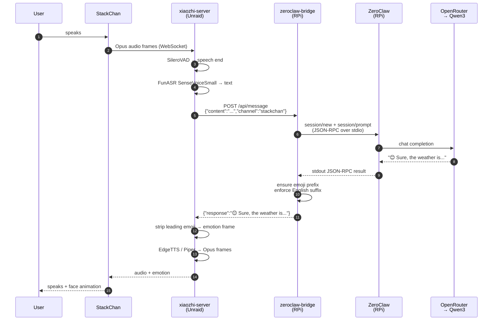

# Architecture

## TL;DR

- Three hosts: **StackChan** (the robot on your desk) → **Unraid** (runs xiaozhi-esp32-server) → **Raspberry Pi** (runs ZeroClaw + a FastAPI bridge).
- Audio goes device → Unraid → (text) → RPi → (response text) → Unraid → (audio) → device. The RPi never touches audio.
- Everything is LAN-local **except** the LLM call, which goes out to OpenRouter from the Pi. EdgeTTS is cloud too when it's the selected TTS; Piper is fully local.
- The "xiaozhi ↔ brain" seam is HTTP + ACP-over-stdio, not a library call — so either side can be swapped independently.
- The robot speaks the **Xiaozhi WebSocket protocol** (see [protocols.md](./protocols.md)). It has no hardcoded knowledge of ZeroClaw.

## Actors

| Actor | Host | Role | Process |
|---|---|---|---|
| **StackChan** | Desk | Captures audio, plays audio, renders face, runs MCP tools for head/LED/camera | ESP32-S3 firmware built from `m5stack/StackChan` |
| **xiaozhi-esp32-server** | Unraid | VAD → ASR → LLM (proxy) → TTS pipeline, emotion dispatch, OTA | Docker container |
| **ZeroClawLLM custom provider** | Unraid (inside container) | Translates xiaozhi's LLM-provider interface to an HTTP POST | Python, mounted via volume |
| **zeroclaw-bridge** | RPi | Accepts HTTP POSTs, spawns/holds a `zeroclaw acp` child, speaks ACP JSON-RPC to it | FastAPI + uvicorn under systemd |
| **ZeroClaw daemon** | RPi | The configured persona — runs the agent loop, calls the LLM, consults `SOUL.md`/`IDENTITY.md`/`MEMORY.md` | Rust binary (`zeroclaw acp`) |
| **OpenRouter** | Cloud | Routes LLM calls to Qwen3-30B-A3B-Instruct-2507 | External |

## Data flow (single utterance)

See [protocols.md](./protocols.md) for every wire format referenced above.

## Why this shape

- **Audio lives with Unraid** because the StackChan firmware already speaks the Xiaozhi WS protocol; xiaozhi-esp32-server is the matching server. Putting the brain next to the mic would require us to reimplement that protocol, and we'd still need a voice server.
- **The brain lives with the Pi** because ZeroClaw already has memory, tools, persona, channels, LLM routing wired up. The StackChan is just another channel into the same agent.
- **A bridge lives between them** because ZeroClaw's HTTP API is observational; to *prompt* a running agent you have to use ACP (JSON-RPC 2.0 over stdio) against a `zeroclaw acp` child. The bridge is a tiny FastAPI adapter that does exactly that.
- **The seam is a custom xiaozhi LLM provider** (`zeroclaw.py`, mounted into the container). xiaozhi-server thinks it's calling a local Python LLM class; the class just does an HTTP POST to `<RPI_IP>:8080/api/message`. That means we could swap ZeroClaw for anything HTTP-serviceable without touching xiaozhi.

## What each host sees

**StackChan device** knows only:
- An OTA HTTP URL (`http://<UNRAID_IP>:8003/xiaozhi/ota/`)
- A WS URL (provided by OTA response, typically `ws://<UNRAID_IP>:8000/xiaozhi/v1/`)

It does **not** know about the RPi, ZeroClaw, or any LLM.

**Unraid / xiaozhi-server** knows:
- Its own device-facing WS + OTA ports
- A handful of pluggable providers selected via `data/.config.yaml` `selected_module:`
- The LLM provider's `base_url: http://<RPI_IP>:8080` to reach the bridge

It does **not** know about ACP, ZeroClaw workspace files, or the OpenRouter key.

**RPi / bridge** knows:
- How to `subprocess.Popen("zeroclaw acp")` and speak JSON-RPC 2.0 on stdin/stdout
- How to wrap turns that arrive with `channel="stackchan"` in the English+emoji sandwich
- The OpenRouter API key lives in ZeroClaw's config, not in the bridge

**ZeroClaw** knows everything agent-side — provider keys, memory, tools, persona files. It does **not** know what host/channel the request came from beyond the `channel` string passed in.

## Bridge admin endpoints (`/admin/*`)

The bridge exposes a small localhost-only HTTP surface for runtime configuration mutations. Useful when an external operator (a script, a cron job, a separately-running ZeroClaw daemon on a more capable model) needs to flip behaviour without an interactive SSH session. Bound to `127.0.0.1` only — LAN callers get `403`.

| Endpoint | Effect | Restart |
|---|---|---|
| `POST /admin/kid-mode` `{enabled: bool}` | Writes the kid-mode state file. | bridge (delayed 2 s so the response flushes) |
| `POST /admin/persona` `{file, content}` | Overwrites a workspace persona file (`SOUL.md`, `IDENTITY.md`, `USER.md`, `AGENTS.md`, `TOOLS.md`, `BOOTSTRAP.md`, `HEARTBEAT.md`, `MEMORY.md`). Atomic via `.new` + rename. | none |
| `POST /admin/model` `{daemon, model}` | TOML-edits `default_model` in the chosen daemon's `config.toml`. | named daemon |
| `POST /admin/safety` `{action, tool}` | Adds/removes a tool in `MCP_TOOL_ALLOWLIST` via the `# === ADMIN_ALLOWLIST_START/END ===` marker block. py_compile-validated; on syntax error the bridge is left untouched. | bridge (self-restart) |

Paths and systemd unit names are env-configurable (`ZEROCLAW_VOICE_CFG`, `ZEROCLAW_VOICE_UNIT`, `ZEROCLAW_DISCORD_CFG`, `ZEROCLAW_DISCORD_UNIT`, `ZEROCLAW_WORKSPACE`); defaults match the documented RPi layout. The endpoints are off-the-shelf — if you don't reach `127.0.0.1:8080/admin/*`, they don't fire.

## Threat-model implications

- **Device compromise** gives an attacker a WS session to xiaozhi-server and the ability to invoke any server-exposed MCP tool. It does **not** give them the LLM key, ZeroClaw's memory, or network access to OpenRouter beyond what proxied prompts can achieve.
- **Unraid compromise** gives them access to the bridge over HTTP (no auth currently). Anything the bridge can ask ZeroClaw, the attacker can ask it. The `/admin/*` mutation endpoints are unreachable (they're `127.0.0.1`-only).
- **RPi compromise** gives them everything — LLM keys, memory DB, workspace persona files.
- **OpenRouter compromise** gives them log access to every prompt sent. Treat prompts as non-confidential.

See [`../ROADMAP.md`](../ROADMAP.md) for related backlog items (privacy-indicator LEDs, child-safety hardening).

## See also

- [hardware.md](./hardware.md) — what the device actually is.
- [voice-pipeline.md](./voice-pipeline.md) — what Unraid runs.
- [brain.md](./brain.md) — what the Pi runs.
- [protocols.md](./protocols.md) — what's on the wire.

Last verified: 2026-04-25.
